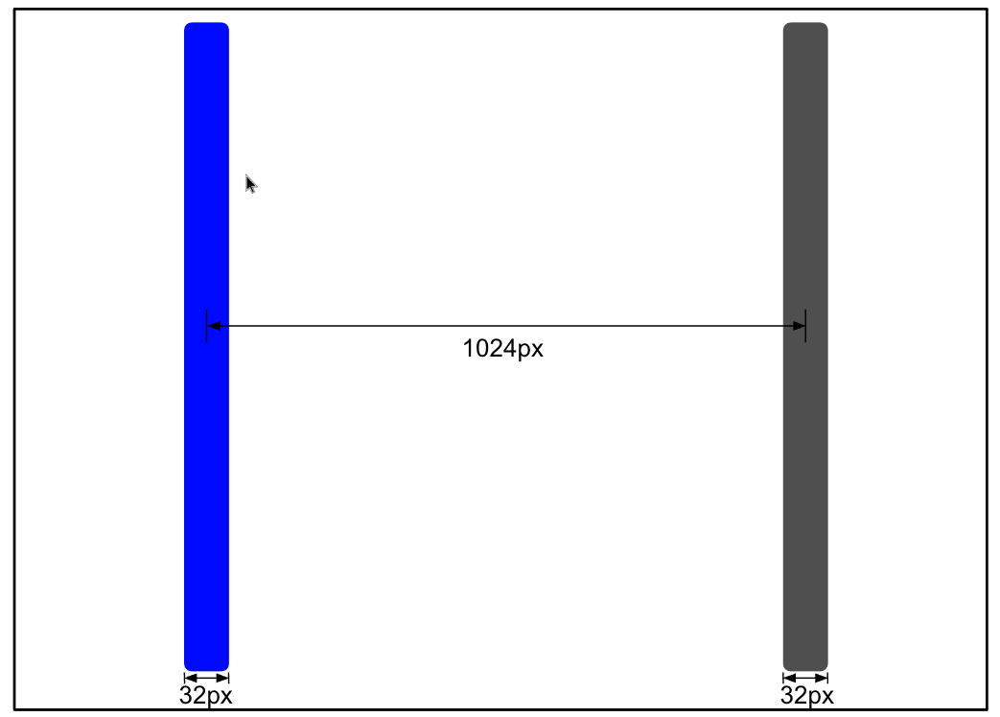
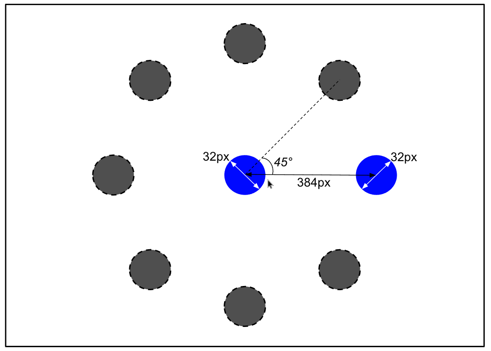
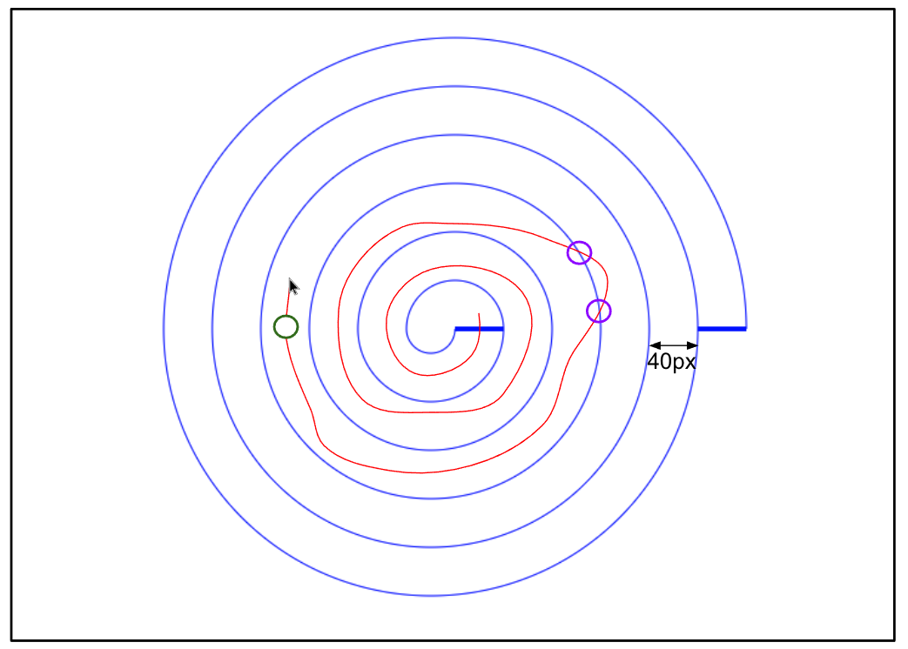
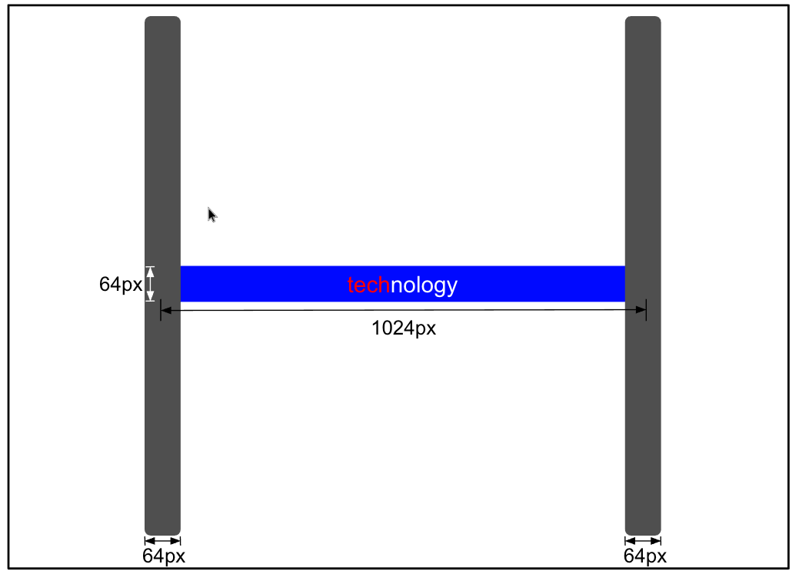
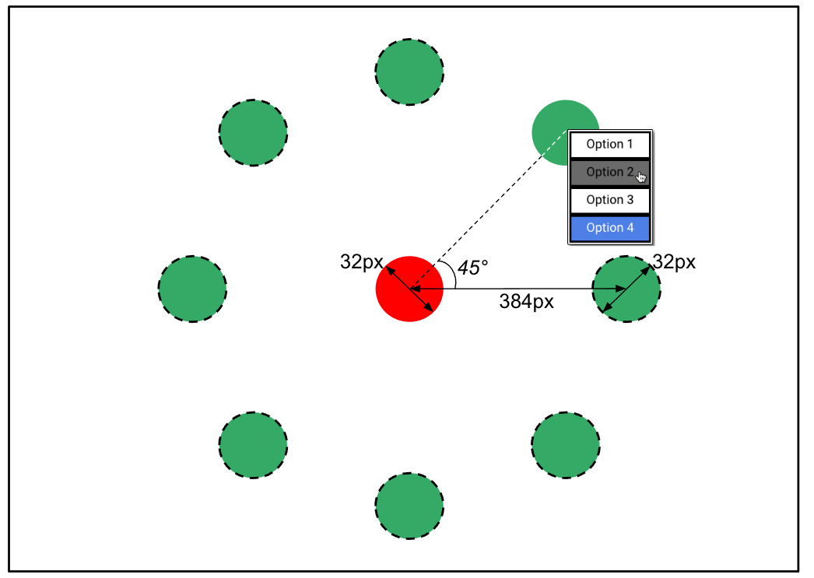
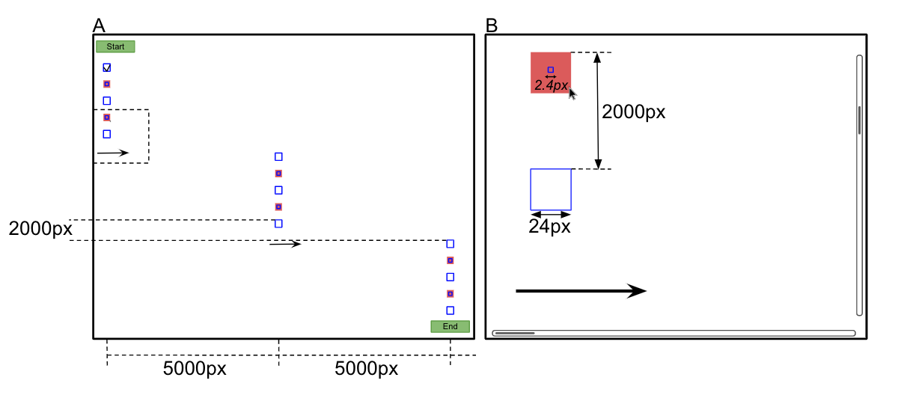
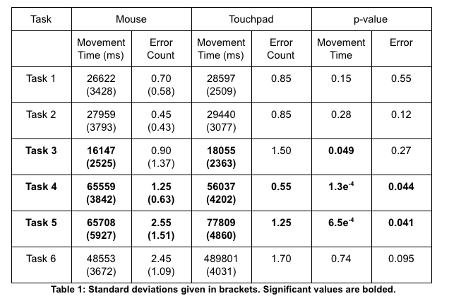
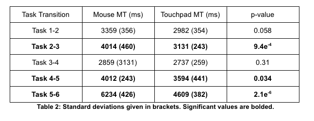
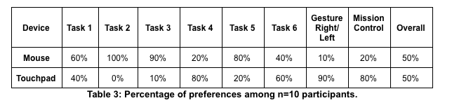
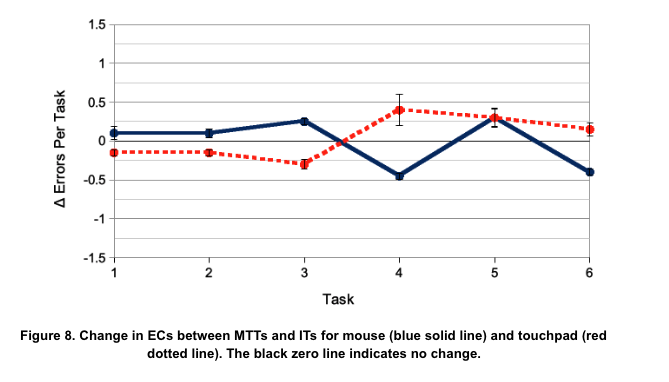

# A Comparative Evaluation Between Computer Mouse and Touchpad Usability in the Modern World
### Purpose
The aim of this study was to compare the usability between mouse and touchpad in an age and culture where both are equally as widespread and regularly operated. As defined by the International Organization for Standardization (ISO 9241-11), usability refers to the extent to which a product can achieve specified goals with effectiveness, efficiency and satisfaction. This was evaluated using a multi- tasked testing environment consisting of various ISO as well as novel human-computer interaction (HCI) tasks (which are often singly used in similar studies), in combination with typing and gestural controls, that aims to mimic and generalize to real-life user cases. Performing many different tasks in one trial also elicits the degrees of fatigue experienced for each device.
### Abstract
Computer mice and touchpads are ubiquitous modes of interfacing with computers, each with their unique set of advantages and disadvantages. This research endeavor sought to investigate the efficiency and satisfaction of cursor and gesture control between mouse and built-in touchpad input devices. Ten adult subjects with prior experience using both devices were recruited to perform many tasks and trials that elicited the key strengths and weaknesses of each. Overall, both devices had comparable speed, accuracy and user preference, though they differed significantly during specific tasks. The mouse was significantly faster with path tracing and double/right- clicking tasks, while the touchpad was better suited for keyboard homing tasks and gesture controls, as well as demonstrating greater robustness against fatigue effects. User preference was consistent with performance, and device assessment questionnaires found no significant differences between mouse and touchpad.
### Keywords
Cursor Control; Computer Mouse; Trackpad; Touchpad.
### Abridged Methods
6 male and 4 female subjects (aged 20.2 ± 1.2 years) attending McMaster University were recruited through convenience sampling, each with 5 years of average experience for both mouse and touchpad, as well as an average usage of 15 and 16 hours per week for mouse and touchpad, respectively.

The multi-tasked trial (MTT) consisted of six individual tasks (ITs), each separated by different gestural controls. First, each task was independently introduced to participants who performed the same task twice with data collection averaged over both (each separated by a one-minute break). Upon completing all six tasks independently, data collection commenced for two MTT trials, each separated by two-minute breaks and averaged together. All tasks are described in the order in which they appear in the MTT below.

The experiment was a within-subjects design. Participants were randomly assigned to one of two groups (6 participants per group) to offset any potential order-effects by counterbalancing. The independent variable is input device with two levels: mouse or touchpad. The dependent variables measured usability and included MT (the reciprocal of speed, measured for each independent task and the entire trial in milliseconds), EC (percentage of misclicks, unsuccessful target selections or other previously defined errors), questionnaire, and survey responses.

##### Task 1: One-dimensional reciprocal clicking

The first task used a traditional Fitts’ Law reciprocal clicking exercise with two targets on opposing sides of the screen. Participants alternated clicking between both targets with the left-mouse button as quickly and accurately as possible. Any click made outside the active target was recorded as an error. This task was completed after 30 click events, regardless of error (i.e. each target would become active 15 times). To access the next task, participants were instructed to gesture right into the next workspace.
##### Task 2: Two-dimensional radial reciprocal clicking

This next task had eight circular targets arranged circumferentially around a central circular target. Only two targets were visible to the subject at once: the central target and a second which appeared randomly in one of eight locations in the circumferential layout. After reciprocally selecting between both six times (i.e. after six click events), the second target was replaced by a new one in one of the seven remaining possible locations. This process was repeated by the participants until all eight targets in the circular layout were reciprocally selected with the central target (order was randomized). Errors were recorded for any selections made outside the active target. Accessing the third task required the user to access Mission Control (a bird’s eye view of all open windows) via gesture controls and switch to another window in the same workspace.
##### Task 3: Spiral path tracing

In this task the subjects started from the center of a spiral, held down the left-mouse-button and passed the starting line. They went through the spiral path while tracing their cursor movement until reaching the finish line. Errors were recorded each time the cursor trace (shown in red) intersected the spiral track or was interrupted (by letting go of the mouse button). Subjects were monitored and instructed not to purposefully pass directly through track lines (in other words, sacrificing accuracy for speed). To access the next task, subjects gestured to the next workspace on the right.
##### Task 4: Pointer-keyboard homing

Similar to Task 1, subjects alternated between two rectangular targets on opposing sides of the screen. After a target on either side was selected, the subject used the built- in keyboard to type in a word displayed in the active (highlighted in blue) central panel. This panel did not have to be clicked. Mistypes were not recorded as errors (keyboard accuracy is not under investigation), and backspacing was not required (only the correct letter at a specified location was accepted). The same set and order of ten-lettered words were used by all participants and differed for each practice round and trial (participants could not anticipate the words). Typing progress was shown via red text (to denote letters that have already been typed in). After completing 24 rounds (i.e. 24 words typed in or 12 selections for each target), this task was completed and the next was available upon switching windows using Mission Control.
##### Task 5: Radial double-and-right clicking

This task used a layout identical to Task 2, though with two different types of targets. The central target (displayed in red now), had to be double-clicked for a successful selection (single left-mouse button clicks were recorded as errors and did not continue the task). The circumferential targets (now displayed in green) had to be right-clicked, opening a context menu with four options, one of which was randomly chosen to be the target (highlighted in blue). The subject selected (left-mouse button click) the highlighted option before returning to the central target. Selecting the incorrect (non-highlighted) option or produce an error and continue the task. After reciprocally selecting between both targets six times (i.e. after three double-click, three right-click and three potential single-click events), the green target was replaced by a new one in one of the seven remaining possible locations, determined randomly. The subject gestured left to the original workspace (used in Task 1) and used Mission Control to switch windows.
##### Task 6: Scroll-and-zoom

This task evaluated the scrolling and zooming capabilities of mouse and touchpad. A total of 15 checkboxes were displayed on the screen, each separated vertically by 2000px. They were divided into three groups of five, wherein each group occupied different horizontal positions on the screen (left, middle and right). The subject scrolled vertically and horizontally to sequentially check all targets. 2000px after the last checkbox in the first two groups, a right-facing arrow indicated horizontal scrolling to the next group. Every second checkbox for each group was minimized by a factor of 10, and so the subject zoomed in to check the box (which was surrounded by a red background to denote its presence), and then zoomed back out to continue the task. Errors were recorded whenever the subject did not select a checkbox, misclicked or scrolled past (horizontally or vertically) a checkbox in the viewport without first selecting it. The task begins once the subject clicks on the start button at the top left (event listeners and timer are both initialized) and ends when the subject clicks the end button at the bottom right. This task completes the trial.
##### Questionnaire & Preference Surveys
After completing all tasks and trials, participants completed a device assessment questionnaire produced from ISO 9241-9 that assesses operation and comfort using 13 questions and a 5-point Likert response scale. Participants additionally specified their preferred input device for performing each task, gesture control and the overall trial.

### Abridged Results & Conclusion
Unlike previous studies, where experiments were typically tailored towards the mouse, the results presented here demonstrate similar and nonsignificant results between mouse and touchpad over the entire trials. However, significant differences arise in efficiency (both MT and EC) and user satisfaction (preference surveys) when evaluating tasks individually as both devices are better suited for different operations. For instance, the touchpad performs better for keyboard homing tasks while the mouse is superior for double and right- clicking.

This is also the first study to empirically investigate the effects of fatigue on device performance as well as the usability of gestural controls. In both cases, the touchpad outperformed the mouse by demonstrating greater user preference and speed for gestural controls while not exhibiting any significant deteriorations in performance over the length of the trials.

In summary, this study demonstrates that mouse and touchpad are essentially equivalent in overall usability, though they can vary significantly under certain conditions as they are better suited for different tasks by design. These results underscore the importance of designing HCI experiments that accurately simulate user tasks of interest, as well as the impact that experimental design or length can have on performance.

#### See More
Read the full paper [here](mouseVtouchpad.pdf), written in accordance with the Association for Computing Machinery's (ACM) Special Interest Group on Computer–Human Interaction (SIGCHI) guidelines.

### Supplementary Material
##### Supplementary Table 1

##### Supplementary Table 2

##### Supplementary Table 3

##### Supplementary Figure 8

#### Acknowledgements
The code from tasks 1-4 has been modified and adapted from Cornell University's [product evaluation software](http://ergo.human.cornell.edu/default.htm). The author would like to thank PhD candidates Adam Lenarcic and Geneva Smith for their support and guidance in the undertaking of this project.

#### Author
Michael Balas

#### License
[GNU General Public License](../LICENSE)

