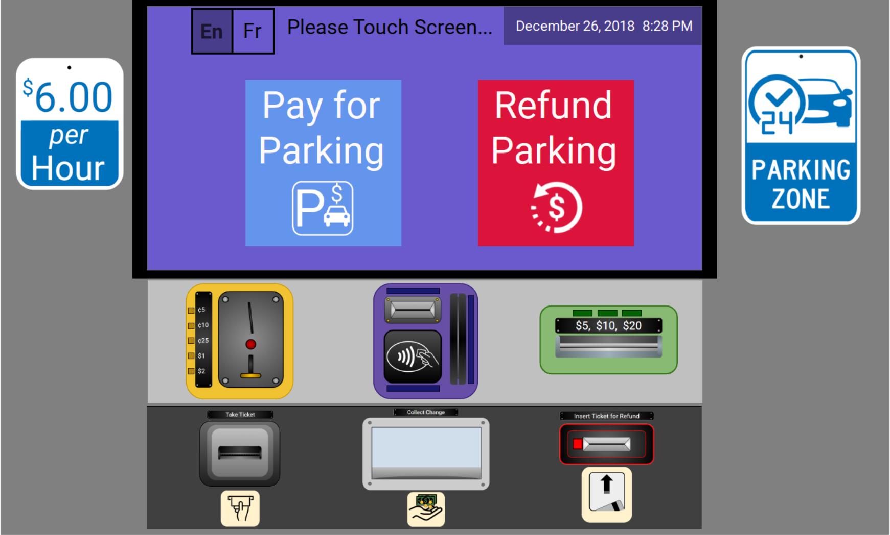

# Parking Meter User Interface
## Purpose
Inspired by Don Norman's critically acclaimed book, **The Design of Everyday Things**, the goal of this work was to design and implement a user interface (UI) that was based off of Norman's Design Principles. Here, I showcase my design for a touchscreen-based parking meter UI. For my purposes, it was sufficient to develop the application in Visual Studio with C# and imagine that the mouse pointer is the fingertip. The actual functionality of the system is quite minimal - my primary goal was to design a usable interface, and use my programming framework to simply support navigation between screens and the minimal functionality.

## Background
Mechanical parking meters are extremely usable devices - you put in your coins, it adds time, and you walk away. Modern digital parking meters also support credit cards, but interacting with these systems is complicated and error prone. A quick survey of parking meters around any large urban area reveals little consistency in the design of these, additional instructions taped to the front of the machine, spurious buttons that have no apparent function and no feedback, and various other major usability issues. 

I sought to design a new touchscreen-based UI for parking meter kiosks (the type where you pay a certain amount of cash, and leave a printed ticket on your dashboard indicating how long you can park for) using Norman's Design Principles, listed below:
* **Affordances**: The proper affordances must exist to make sure the desired actions are possible. It refers to the relationship between the properties of a physical object and the capabilities of an interacting agent (i.e. animal, human, machine, robot etc.) that determine just how the object could possible be used. A chair affords (*"is for"*) support, and therefore, affords sitting. Most chairs can also be carried by a single person (they afford lifting), but some can only be lifted by a strong person or by a team of people. If young or relatively weak people cannot lift a chair, then for these people, the chair does not have that affordance, it does not afford lifting. 
* **Signifiers**: Effective use of signifiers ensures discoverability and that feedback is well-communicated and intelligible. Affordances determine what actions are possible. Signifiers communicate where the action should take place (i.e. *signals*). It refers to any mark or sound, any perceivable indicator that communicates appropriate behaviour to a person. Signifiers can be deliberate and intentional, such as the sign push on a door, but they may also be accidental and unintentional, such as our use of the visible trail made by previous people walking through a field or over a snow-covered terrain to determine the best path.
* **Constraints**: Providing physical, logical, semantic, and cultural constrains guides actions and eases interpretation. The design concept of constraining refers to determining ways of restricting the kind of user interaction that can take place at a given moment. This reduces the large number of possible user decisions to only a few intuitive choices, minimizing learning and mistakes. 
* **Mappings**: The relationship between controls and their actions follows the principles of good maping, enhanced as much as possible through spatial layout and temporal contiguity. In steering a car, for example, we rotate the steering wheel clockwise to cause the car to turn right: the top of the wheel moves in the same direction as the car. 
* **Feedback**: There should be full and continuous information about the results of actions, and the current state of the product or service. After an action has been executed, it should be easy to determine the new state. Feedback must be immediate (even a delay of a tenth of a second can be disconcerting), informative, planned (all actions should be confirmed in an unobtrusive manner) and prioritized (important signals should capture attention).  
* **Discoverability**: Determining what actions are possible and the current state of the device. Is it possible to even figure out what actions are possible and where and how to perform them? Discoverability results from appropriate application of the previous principles.
* **Conceptual Model**: The design should project all the information needed to create a good conceptual model of the system, leading to understanding and a feeling of control. A conceptual model is an explanation, usually highly simplified, of how something works. The files, folders and icons you see displayed on a computer screen help people create the conceptual model of documents and folders inside the computer, or of apps or applications residing on the screen, waiting to be summoned. These are effective conceptualizations designed to make them easier to use.

## Features
This parking meter UI supports the following features:
* Ability to use cash to pay for parking (coins and bills)
* Reimburse the user with change when they exceed the required amount
* Ability to use card (credit/debit) tapping, swiping and inserting for parking. Inserting a card requires a pin number
* Ability to enter an account number as a backup to tapping/swiping/inserting a card
* Informative and real-time feedback of costs, time parking for, and time parking until
* Ability to get refund of time for returned tickets, through either cash (coins and bills) or card (and account number)
* Ability to backtrack and navigate between screens to fix errors or alternate goals
* Language controls to change between English and French
* **Promotional offers for nearby stores that can be printed after paying for parking (increases incentive to park in the lot)**
* **Ability to send SMS parking reminders to a phone number(s) at a specified time before the parking expires**

## Hardware
The hardware of this proposed parking meter is designed to offer intuitive control without limiting the range of choices the user can make. The touchscreen is supplemented with dividers on either side to prevent others from seeing bank account or pin numbers, as well as minimize any glare from the sun (if stationed outside) or other light sources. On either side of the touchscreen are large signs denoting 24hr parking and a rate of $6/hr, so users are notified of this before having to use the system.

Below the touchscreen lies the physical equipment for processing payments and drafting tickets/receipts. This equipment is separated into two spatially distinct categories of *Value-In* and *Value-Out*. The group of *value-in* is positioned directly below the touchscreen and is surrounded by a light gray box. It supports coin-, card- (credit/debit) and bill-based payments. The coin-based payment resides on the left side, with a slot to insert coins (all Canadian coins are accepted), as well as a slot directly below to return any false or unreadable coins back to the user. Card-based payments are in the center, where the user has the options of inserting, swiping or tapping their credit or debit cards to issue a payment. Bill-based payments are on the right, with a single slot that accepts 5, 10 and 20 dollar bills. If the bill is false, unreadable or inserted incorrectly, it will not be accepted by the machine.

The group of *value-out* is positioned below the *value-in* group and is surrounded by a dark gray background. This group of devices supports ticket printing, ticket reading, and cash (coins and bills) returns. The ticket printer (positioned left) can dispense both tickets (for users to place on their dashboard) and coupons/promotions for nearby stores. The ticket reader (positioned right) accepts non-expired parking tickets for issuing refunds to customers based on the remaining time they have left. Since there are no actual users buying tickets, time-remaining and redeemable funds are hard-coded and used as examples.

Although both printer and reader have identical slots for congruent ticket shapes, they are distinguished by position, label and shape. The ticket printer is bevelled into the machine, indicating output, while the ticket reader is not. Furthermore, even if one slot could support both printing and reading, users would likely be confused and not think to insert the ticket from the same place it was outputted. In the center of the *value-out* group lies the cash refund box. This box provides bill and coin change or refunds based on remaining time left. It has a moveable glass pane to prevent any coins or bills from falling out while they drop onto the wedged support. 

## Touchscreen
This touchscreen is designed to provide intuitive control with informative and immediate feedback as well as simple instructions and error correction. The date and time is always displayed in the top right. The majority of displays will have an undo/back button (left facing arrow) at the top left, allowing users to backtrack and fix potential errors or alternate goals. One exception to this is the default home page, which instead has two small toggles in the top left: En (automatically active) and Fr, which provide language controls. The home page has two main buttons: *Pay for Parking* and *Refund Remaining Time*. 
##### Pay for Parking
This blue button is located on the left and, as the name implies, generates a sequence of actions that lead to the user paying for parking over a specified time and receiving a receipt (ticket) of transaction to prove this payment. One major problem with parking meters (especially mechanical ones) is the order of actions: the user first inserts money and then time is added. This is a poor conceptual model that places undue emphasis on how much the user is willing to pay, rather than how long they actually need to keep the car parked. Like transactions of most other market goods, the user is aware of the product and total price before paying. Furthermore, the user likely wouldn’t realize how much they needed to pay until they inserted enough money to fill their necessary time slot, potentially leading to an unnecessary refund, restart and frustration.

Instead, this system begins by allowing the user to set the time they’re willing to park until. The user can use up/down arrows to increase/decrease the hour (increments of 1) and minute (increments of 15), as well as change whether it is AM or PM (this is also done automatically as they traverse 12 hours). Below the time they’ve set they also see what day they are parking until (i.e. today or tomorrow). On the right, the price is dynamically updated together with how much time they’re paying for (i.e. difference between current time and time they set). This offers immediate feedback to notify them of how much they’ll be paying as well as the worth of their payment (i.e. parking time).

After setting the time, the user is presented with two other buttons: Cash and Card. By selecting *Cash*, the user can pay for parking using both coins (slot on the left below) and bills (slot on the right below). The screen will ask the user to pay for either and display arrows pointing downwards to both slots. Moreover it shows colour-coded labels to ensure fast and intuitive mapping. As the user inserts bills or coins, the remaining price drops in real-time to provide them with constant feedback. If the user cancels before paying the full amount, all change is returned. If the user pays more than the remaining price, the difference is returned as change. 

By selecting *Card*, the user can pay by swiping (no further action required), tapping (no further action required) or inserting (user must subsequently insert pin). Alternatively, they can also pay using their account number.

After successfully paying for parking using either method, the machine prints the ticket which displays the time of payment, time of parking expiration and amount paid. It also instructs the user how to display the ticket (i.e. on car dashboard, curbside). From here, the screen displays three buttons: “Send SMS Reminder”, “Done”, and “Find Good Deals Nearby”.

If the user wants a reminder of their parking expiration, they can select “Send SMS Reminder”, to which they will be prompted to enter their phone number and select how much time before expiration they would like before receiving an automated text (ranges from 10-60 minutes, at 10 minute increments). After completing this form, the user can navigate back to it if they wish to input additional numbers as well (e.g. send texts to others who were in the car). 

This proposed parking meter can also act as a *retail-hub*, making deals with nearby stores to offer promotions to people who use the meter. The user has the option of printing one coupon for each parking instance (i.e. can’t print multiple coupons), each offering deals for various categories of products (i.e. food/beverages, entertainment, clothing/accessories, etc.). In the examples presented in this UI, the user can choose between Starbucks, Lululemon, Walmart and Cineplex offers. 

Finally, the user can select “Done” when finished, restarting the application and bringing the window back to the default home screen. 

##### Refund Remaining Time
This red button is located on the right and refunds the remaining time on a user’s parking ticket. When the user selects refund, the screen shows a mapping of all the hardware controls and highlights the spatial location of the Refund-Slot (which is also labelled with both text and icon). After inserting the ticket, the screen will display the remaining parking time left as well as redeemable funds (hardcoded as an example). The user has the option of receiving reimbursement via cash (received through the change collector) or directly into their bank account (either by inserting their card or directly inputting their account number). The user is then notified that the refund was successful and is brought back to the home screen (after selecting “Done”). 

The image below showcases the the full touchscreen-based parking meter kiosk (on the homescreen).

## Run Instructions
All code and project files are contained under *VisualStudio_ParkingMeter*. There is also a Windows-based executable (*ParkingMeter.exe*) for convenience. Upon running ParkingMeter, the UI will open full screen. For reference: the touchscreen is blue and surrounded by a black border (though this is not apparent from the 3D perspective, the black border represents 'hoods' that are similarly found in ATMs so prying eyes cannot see pins or account numbers). Underneath are all of the hardware controls of the parking meter (coin slot, card insert/swipe/tap, bill slot, ticket printer, change collector, and ticket refunder). 

For some of the hardware controls, there are small buttons (that aren't technically part of the UI) that allow you to specify the quantity or method of payment (e.g. 5 cents versus $20, or tap versus insert). There is also a button next to the refund slot for you to *insert the ticket* back in. 

When the system says it's printing a ticket or giving money back, you may notice some time before a message box appears as well as a 'loading' cursor display. This is by design (to signal the fact that printing or distributing change takes some time). 

#### Author
Michael Balas

#### License
[GNU General Public License](../LICENSE)
